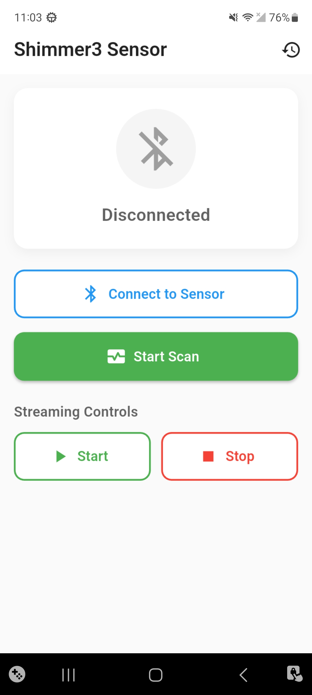
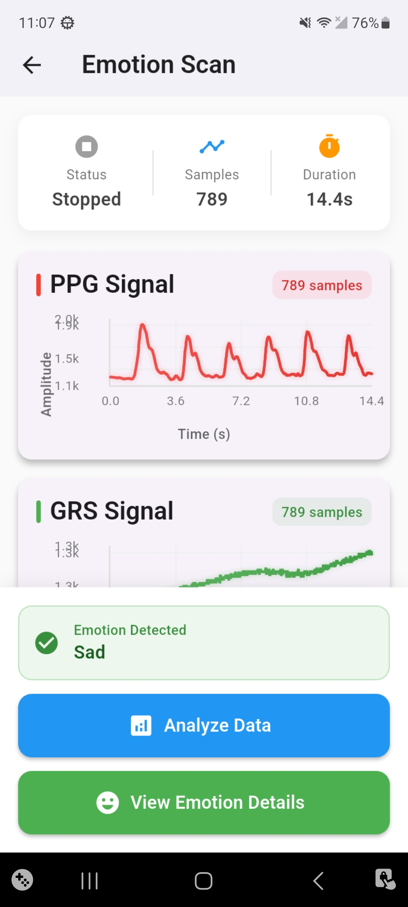
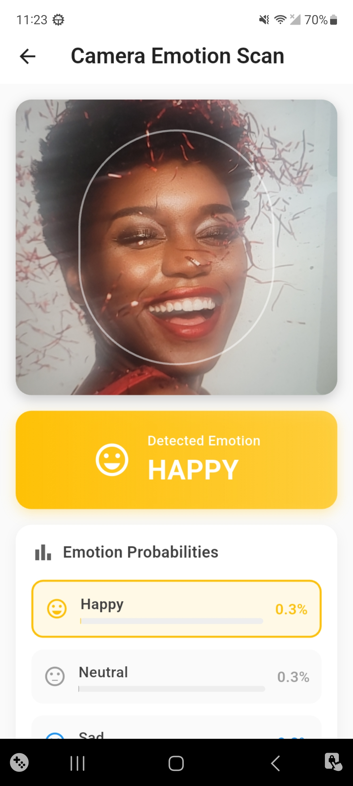
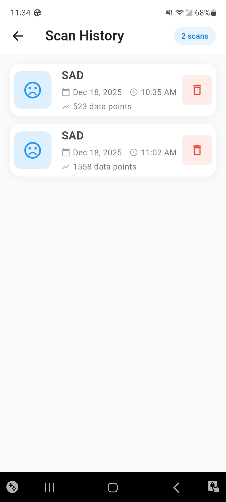

# Emotion Sensor App

This Flutter application is a comprehensive tool for real-time emotion detection using physiological signals from a Shimmer3 sensor and facial expression analysis from the device's camera. The app is designed to collect, process, and analyze data from multiple sources to provide a holistic view of the user's emotional state.

## How it Works

The application follows a sophisticated pipeline to determine the user's emotion:

1.  **Sensor Connection:** The app establishes a connection with a Shimmer3 sensor via Bluetooth to stream physiological data.
2.  **Data Acquisition:**
    *   **Physiological Signals:** The `ScanPage` collects real-time data from the Shimmer3 sensor, including Photoplethysmography (PPG), Galvanic Skin Response (GSR), and accelerometer data. This data is visualized in real-time using interactive charts.
    *   **Facial Expressions:** The `CameraPage` utilizes the device's camera to capture the user's facial expressions.
3.  **Feature Extraction:**
    *   From the physiological signals, a `FeatureExtractor` module calculates a variety of features. These include Heart Rate (HR), Heart Rate Variability (HRV), and GSR statistics (mean, standard deviation, etc.).
4.  **Emotion Prediction:**
    *   **Physiological Model:** The extracted features are fed into a pre-trained TensorFlow Lite model within the `EmotionInterpreter`. This model predicts the user's emotional state in terms of valence (pleasure) and arousal (activation). These values are then mapped to discrete emotions like 'Happy', 'Sad', 'Angry', or 'Relaxed'.
    *   **Facial Recognition Model:** A separate TensorFlow Lite model is used in the `CameraModel` to analyze the user's facial expression and classify it into emotions like 'Happy', 'Sad', 'Angry', 'Surprise', etc.
5.  **Data Persistence:** All scan sessions, including the raw sensor data and the predicted emotion, are saved locally using an Isar database. This allows users to review their past sessions in the `ScanHistoryPage`.

## Features

*   **Dual-Mode Emotion Detection:** Combines physiological data from a Shimmer3 sensor and facial recognition from the camera for a more accurate emotion analysis.
*   **Real-time Data Visualization:** Live charts display PPG, GSR, and accelerometer data during a scan.
*   **On-Device Machine Learning:** Utilizes TensorFlow Lite for efficient, real-time, on-device inference, ensuring user privacy.
*   **Scan History:** Persistently stores all scan sessions for later review and analysis.
*   **Detailed Scan Analysis:** Provides a detailed breakdown of each scan, including the predicted emotion and the raw sensor data.

## Technologies Used

*   **Flutter:** For building a high-performance, cross-platform mobile application.
*   **TensorFlow Lite:** For on-device machine learning and emotion prediction.
*   **Isar:** A fast, cross-platform, and highly expressive database for local data storage.
*   **fl_chart:** For creating beautiful and interactive real-time charts.
*   **Camera:** For accessing the device's camera and capturing images for facial emotion recognition.
*   **Shimmer3 API (via MethodChannel):** For communicating with the Shimmer3 sensor.

## Screenshots

| Home Page                                                                                  | Scan Page                                                                                    |
| ------------------------------------------------------------------------------------------ | -------------------------------------------------------------------------------------------- |
|                                            |                                              |
| **Camera Page**                                                                            | **History Page**                                                                             |
|                                        |                                        |

## Getting Started

To get a local copy up and running, follow these simple steps.

### Prerequisites

*   Flutter SDK: [https://flutter.dev/docs/get-started/install](https://flutter.dev/docs/get-started/install)
*   Shimmer3 Sensor

### Installation

1.  Clone the repo
    ```sh
    git clone https://github.com/your_username/Emotion_Sensor_APP1.git
    ```
2.  Install packages
    ```sh
    flutter pub get
    ```
3.  Run the app
    ```sh
    flutter run
    ```

## License

Distributed under the MIT License. See `LICENSE` for more information.
